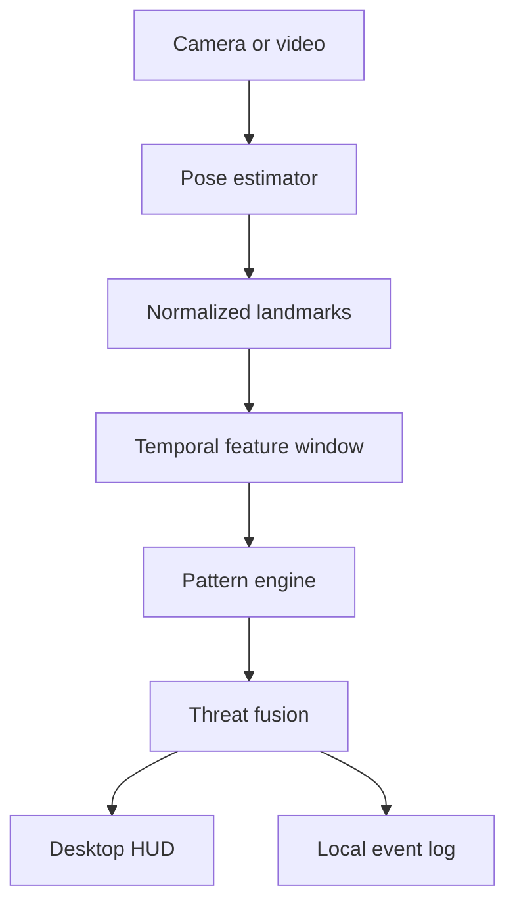

# Aegis Fight Pattern Analyzer

An on-device desktop AI prototype for real-time human motion analysis on Snapdragon-powered HP PCs. It observes pose landmarks, recognizes defensive and aggressive movement patterns, computes an explainable threat score, and records timestamped incidents locally.

> Safety scope: training, sports coaching, supervised security review, and research. It does **not** identify people, infer intent, or autonomously take enforcement action.

## MVP features

- Live webcam or prerecorded-video analysis
- MediaPipe pose estimation with a synthetic demo mode
- Explainable detection of guard, punch-like extension, kick-like extension, rapid approach, and fall-like posture
- Temporal pattern engine with cooldowns and confidence scores
- Live HUD, event timeline, FPS and inference latency
- Local JSONL incident log; no cloud upload
- ONNX Runtime provider selection prepared for Qualcomm QNN (`QNNExecutionProvider`) with CPU fallback

## Quick start

Requires Python 3.10–3.12.

```bash
python -m venv .venv
# Windows: .venv\Scripts\activate
# Linux/macOS: source .venv/bin/activate
pip install -r requirements.txt
python -m aegis.app --source 0
```

No camera available? Run the built-in deterministic demonstration:

```bash
python -m aegis.app --demo
```

Run tests:

```bash
pytest -q
```

## Snapdragon deployment

The prototype isolates model execution behind `SnapdragonSession`. On a Snapdragon X Elite/Plus Windows PC, install a Qualcomm-QNN-enabled ONNX Runtime build and supply a compatible ONNX model:

```powershell
$env:AEGIS_MODEL_PATH="models\pose_model.onnx"
python -m aegis.app --source 0 --prefer-qnn
```

At startup the app reports the selected execution provider. If QNN is unavailable it explicitly falls back to CPU. See [docs/SNAPDRAGON_DEPLOYMENT.md](docs/SNAPDRAGON_DEPLOYMENT.md) for the Qualcomm AI Hub conversion and benchmarking path.

## Architecture



## Repository layout

- `aegis/app.py` – desktop loop and command-line interface
- `aegis/pose.py` – MediaPipe and deterministic demo pose sources
- `aegis/patterns.py` – temporal, explainable pattern recognition
- `aegis/runtime.py` – Snapdragon/QNN provider adapter
- `aegis/ui.py` – OpenCV HUD rendering
- `tests/` – deterministic unit tests
- `docs/` – proposal and deployment documentation

## Current milestone

This is the functional Day-1 prototype. Before challenge submission it still needs measurement on the actual Snapdragon-powered HP PC, a Qualcomm AI Hub model asset, QNN benchmark evidence, polished screenshots, and a short demonstration video.
