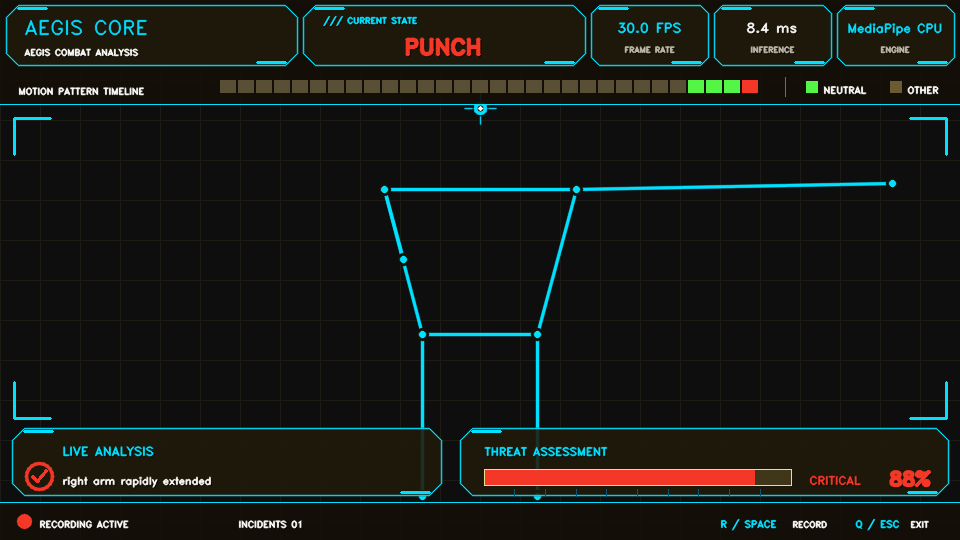
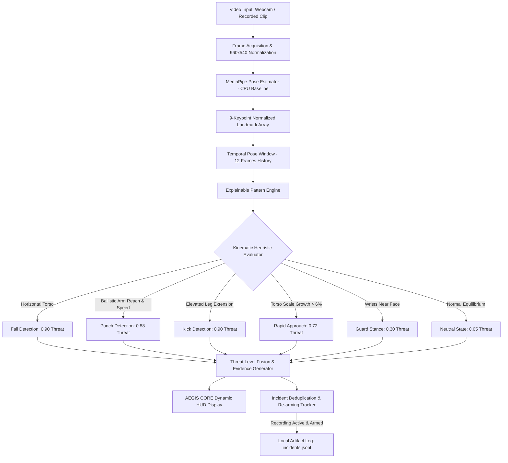

# Aegis: Privacy-Preserving On-Device Combat Motion Intelligence

> Explainable, real-time combat motion and threat pattern analysis running fully on-device, engineered for Snapdragon-powered HP PCs.



---

## 1. Project Title
**Aegis: Privacy-Preserving On-Device Combat Motion Intelligence**<br/>
*Snapdragon AI Lab Build & Present Challenge Submission*<br/>
Participant: **Aniket Kapgate** | [GitHub Repository](https://github.com/aniketkapgate7-crypto/Aegis-Fight-Pattern-Analyzer)

---

## 2. One-Line Value Proposition
Aegis delivers explainable, low-latency combat and athletic motion pattern intelligence entirely on-device without cloud dependencies, facial identification, or biometric risk.

---

## 3. Problem
Conventional physical safety monitoring and athletic combat review suffer from three critical bottlenecks:
1. **Reactive Retrospective Analysis**: Incidents or training form breakdowns are typically reviewed hours or days after occurrence from passive recordings.
2. **Cloud Latency & Network Vulnerability**: Cloud-based video processing pipelines introduce unacceptable transmission latency, consume excessive network bandwidth, and create single points of failure during connectivity disruptions.
3. **Severe Privacy & Surveillance Exposure**: Streaming raw visual footage to external cloud servers exposes participants to biometric harvesting, data breaches, and non-consensual surveillance risks.

---

## 4. Solution
Aegis solves these challenges through an edge-native, human-in-the-loop movement intelligence system:
- **Zero-Cloud Video Processing**: Video streams are analyzed frame-by-frame in local RAM and immediately discarded.
- **Skeletal Landmark Abstraction**: Video pixels are transformed into normalized 2D joint landmarks, stripping all facial identity, clothing, and background context.
- **Explainable Temporal Analysis**: Rather than relying on black-box classification, Aegis evaluates multi-frame kinematic trajectories (joint reach, extension velocity, torso aspect ratios) and outputs human-readable evidence strings.
- **Operator-Centric Telemetry**: The AEGIS CORE Heads-Up Display (HUD) provides live visual threat gauges, event timelines, and optional local incident logging for human decision support.

---

## 5. Current Implemented Features
- **Real-Time Video Ingestion**: Handles live USB/integrated webcam streams or prerecorded digital video clips (`.mp4`, `.avi`, `.mov`).
- **MediaPipe Pose Pipeline**: Detects 9 critical anatomical landmarks (nose, shoulders, wrists, hips, ankles) with visibility confidence gating.
- **Explainable Pattern Recognition**: Deterministically identifies 6 distinct motion patterns with confidence scoring and kinematic rationale.
- **Dynamic Threat Fusion**: Translates movement dynamics into graduated threat levels (`LOW`, `ELEVATED`, `HIGH`, `CRITICAL`) with smooth visual gauge indicators.
- **AEGIS CORE HUD**: Renders a geometric 960×540 interface featuring real-time FPS counter, inference latency monitor, active engine indicator, motion timeline, and control status.
- **Local Incident Logging with Threat Re-arming**: Opt-in recording (`R` or `Space`) logs high-threat events to local JSONL (`artifacts/incidents.jsonl`) with intelligent deduplication preventing duplicate triggers for single continuous motions.
- **Deterministic Synthetic Demo**: Full no-camera demonstration mode (`--demo`) for testing and preview generation.
- **Privacy-Safe Preview Export**: Command-line utility (`--export-preview`) that exports dashboard visuals without exposing personal camera feeds.
- **Truthful Runtime Diagnostics**: Dedicated environment diagnostics (`--diagnostics`) reporting active vs. available execution providers.

---

## 6. Privacy and Safety Scope
- **Motion Patterns, Not Intent**: Aegis measures kinematic movement patterns; it does not infer moral intent, malice, or criminal motivation.
- **No Face Recognition**: The pipeline does not extract facial features, biometric templates, or identity data.
- **No Identity Tracking**: Operates completely anonymously with no persistent personal identifiers.
- **Strictly Non-Autonomous**: Aegis is an operator decision-support tool. It must never be used for autonomous physical enforcement, automated discipline, or unsupervised security actions.
- **Strictly Local Storage**: Event logs remain local on the user's workstation. No telemetry is sent to any external server.

---

## 7. System Architecture



---

## 8. Pattern Definitions

| Pattern | Kinematic Trigger Criteria | Threat Level | Primary Evidence String |
| --- | --- | --- | --- |
| **`neutral`** | Upright torso; limbs within baseline zones; no threshold crossed | Low ($0.05$) | `"no risk-pattern threshold crossed"` |
| **`guard`** | Wrists positioned within $1.30\times$ shoulder width of facial landmarks | Elevated ($0.30$) | `"both hands raised near face"` / `"wrist-face distance"` |
| **`punch-like extension`** | Rapid horizontal wrist extension ($>1.45\times$ shoulder width) at speed $>0.90 /s$ | High ($0.88$) | `"[side] arm rapidly extended"` with reach & speed metrics |
| **`kick-like extension`** | Ankle excursion ($>1.35\times$ shoulder width) at speed $>0.65 /s$, elevated above hip line | Critical ($0.90$) | `"[side] leg extended"`, `"ankle elevated"` |
| **`rapid approach`** | Torso scale expansion $>6\%$ across a 3-frame window at relative rate $>0.80 /s$ | High ($0.72$) | `"body scale increased rapidly"`, `"torso scale growth %"` |
| **`fall-like posture`** | Torso horizontal-to-vertical ratio $>1.25$ with compact vertical height | Critical ($0.90$) | `"torso horizontal ratio"`, `"body has reduced vertical height"` |

---

## 9. Installation

### Prerequisites
- Python 3.10 – 3.12 (Python 3.11 recommended)
- Windows 11 (including Windows 11 on Arm for Snapdragon devices) or Linux

### Setup Instructions

```powershell
# 1. Clone the repository
git clone https://github.com/aniketkapgate7-crypto/Aegis-Fight-Pattern-Analyzer.git
cd Aegis-Fight-Pattern-Analyzer\Aegis-Fight-Pattern-Analyzer-MVP

# 2. Create and activate virtual environment
python -m venv .venv
.venv\Scripts\activate

# 3. Install dependencies
pip install -r requirements.txt
```

---

## 10. Running Webcam Mode

To run live analysis using the default integrated or USB webcam (Index 0):

```powershell
python -m aegis.app --source 0
```

To run against a local prerecorded video file:

```powershell
python -m aegis.app --source path\to\sparring_clip.mp4
```

### Keyboard Controls
- **`R` / `Space`**: Toggle incident recording ON / OFF.
- **`Q` / `Esc`**: Exit the application.

---

## 11. Running Synthetic Demo

If no camera is connected or to verify system behavior deterministically:

```powershell
python -m aegis.app --demo
```

---

## 12. Exporting the Privacy-Safe Preview

Generate a clean, privacy-safe dashboard preview without opening a camera or showing a live user:

```powershell
python -m aegis.app --export-preview docs/assets/aegis-core-dashboard.png
```

---

## 13. Running Tests

Aegis includes 17 deterministic unit tests verifying pattern heuristics, safety fallbacks, provider truthfulness, bounded scores, and incident deduplication:

```powershell
pytest -v
```

---

## 14. Benchmarking

Aegis provides a standalone benchmark utility at [`scripts/benchmark.py`](scripts/benchmark.py) to measure throughput and latency against recorded clips without fabricating metrics:

```powershell
# Run benchmark with 100 warm-up frames and 1000 measured frames
python scripts/benchmark.py --source path\to\evaluation_clip.mp4 --warmup 100 --frames 1000 --output artifacts\benchmark.json
```

See [docs/BENCHMARKING.md](docs/BENCHMARKING.md) for full benchmark protocol details.

---

## 15. Current Verified Results

- **Functional Live Webcam Pipeline**: Real-time end-to-end landmark ingestion, pattern classification, threat scoring, and HUD rendering.
- **Deterministic Synthetic Demo**: Fully operational without camera hardware.
- **Automated Test Suite**: 17 / 17 automated tests passing deterministically.
- **Local-Only Incident Logging**: Thread-safe, deduplicated local JSONL event records.
- **Truthful Active Inference Provider**: **MediaPipe CPU** is the verified active pose provider. QNN execution is not falsely claimed.

---

## 16. Snapdragon Optimization Pathway

While the current MVP uses MediaPipe CPU for functional validation, its architecture is modularly separated to facilitate seamless migration to Qualcomm Snapdragon hardware:

```
[Current Baseline]            [Qualcomm Optimization Path]               [Target Platform]
MediaPipe CPU Pose  --->  Qualcomm AI Hub Pose Model  --->  ONNX Runtime (QNNExecutionProvider)  --->  Snapdragon X Elite / Plus NPU
```

1. **Model Selection**: Select an efficient pose model (e.g., YOLOv8-pose or RTMPose) from Qualcomm AI Hub.
2. **Compilation**: Compile and quantize (INT8/FP16) using Qualcomm AI Hub toolchains specifically targeting the Hexagon NPU.
3. **Integration**: Supply the compiled model path via `$env:AEGIS_MODEL_PATH="models/qualcomm_pose.onnx"`.
4. **Verification**: Execute `python -m aegis.app --prefer-qnn --diagnostics` to confirm genuine NPU execution before reporting comparative speedups.

See [docs/SNAPDRAGON_DEPLOYMENT.md](docs/SNAPDRAGON_DEPLOYMENT.md) for step-by-step deployment instructions.

---

## 17. Repository Structure

```
Aegis-Fight-Pattern-Analyzer-MVP/
├── aegis/                         # Core Python package
│   ├── __init__.py                # Package initialization
│   ├── app.py                     # Application CLI, event loop, incident tracking, preview exporter
│   ├── models.py                  # Domain models (Point, PoseFrame, Detection, Pattern)
│   ├── patterns.py                # Kinematic temporal pattern recognition engine
│   ├── pose.py                    # MediaPipe pose estimation adapter
│   ├── runtime.py                 # SnapdragonSession & RuntimeDiagnostics (truthful CPU/QNN)
│   └── ui.py                      # AEGIS CORE heads-up display rendering engine
├── docs/                          # Technical documentation
│   ├── assets/                    # Dashboard preview screenshots
│   │   └── aegis-core-dashboard.png
│   ├── BENCHMARKING.md            # Standardized evaluation protocol
│   ├── MODEL_CARD.md              # Model card and pipeline specifications
│   ├── PROPOSAL.md                # Challenge proposal addressing judging criteria
│   ├── SAFETY_AND_LIMITATIONS.md  # Privacy safeguards, ethical limits & failure modes
│   └── SNAPDRAGON_DEPLOYMENT.md   # Qualcomm AI Hub & QNN execution guide
├── scripts/                       # Developer & evaluation tooling
│   └── benchmark.py               # Reproducible benchmarking script
├── tests/                         # Automated test suite
│   └── test_patterns.py           # 17 deterministic tests
├── .gitignore                     # Git exclusion rules
├── pyproject.toml                 # Build configuration and pytest settings
├── requirements.txt               # Pinned Python package dependencies
├── README.md                      # Comprehensive project documentation
└── THIRD_PARTY_NOTICES.md         # Open-source licenses and ownership statement
```

---

## 18. Limitations
- **Camera Geometry**: Extreme top-down angles distort 2D planar distances.
- **Lighting & Occlusion**: Poor illumination or heavy visual obstructions can degrade landmark visibility, triggering safe fallback to neutral state.
- **Complex Acrobatics**: Tumbling, dynamic dance moves, or rapid celebratory jumping may trigger false strike/approach indications and require human verification.

---

## 19. Third-Party Notices
Aegis utilizes open-source components including Google MediaPipe (Apache 2.0), OpenCV (Apache 2.0), NumPy (BSD 3-Clause), Microsoft ONNX Runtime (MIT), and pytest (MIT). All original application code, heuristics, and documentation are authored and owned by the participant, Aniket Kapgate. See [THIRD_PARTY_NOTICES.md](THIRD_PARTY_NOTICES.md) for full details.

---

## 20. Challenge Submission Status
- **Challenge Track**: Snapdragon AI Lab Build & Present Challenge
- **Submission Branch**: `feat/snapdragon-submission-readiness`
- **Current State**: Fully upgraded, tested, and documented MVP with truthful runtime claims and verified MediaPipe CPU baseline.
